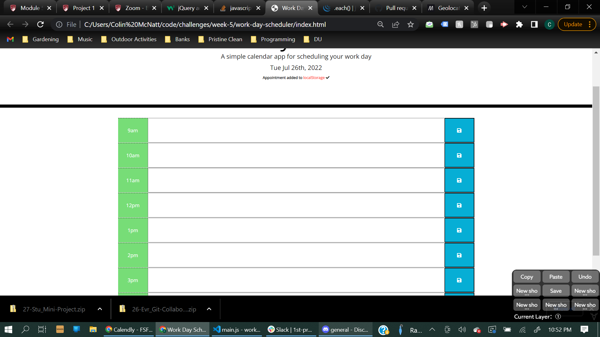

# Work Day Scheduler

This webpage has the ability to save daily events in the users work schedule to hour blocks on an interactive scheduler. Events in the past are denoted by the hour block being the color white, events in the future are colored green, and events that are happening in the present are colored red.

## Functionality:

This daily planner that is used to create a work schedule. When the page loads, the current day is displayed at the top of the calendar.
When the user scrolls down they are presented with time blocks for standard business hours.
When the user views the time blocks for that day, each time block is color-coded to indicate whether it is in the past, present, or future. By clicking into a time block, the user can enter an event. Clicking the save button for that time block saves the text for that event in local storage. When the page is refreshed, the saved events persist.

## Mock Up

## Link to Functioning Application

https://colinmichael89.github.io/Work-Day-Scheduler/
